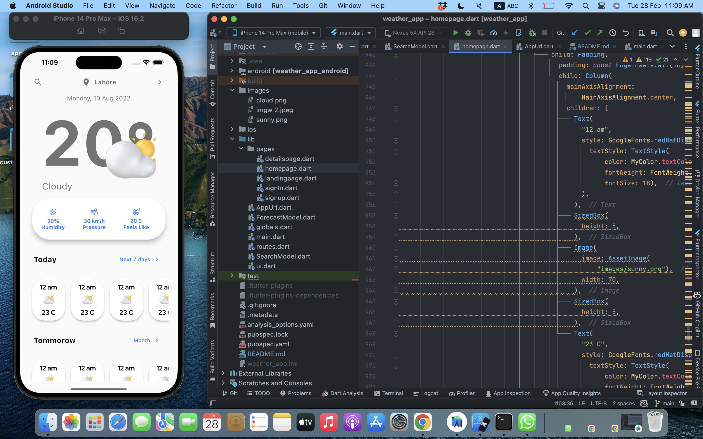

# weather_forcasting

A Weather Forcasting Mobile Application that can predict weather based on current and previous stats. For the backend I have used Rapid API to get result.
<!--
## Getting Started

## Click the Image to check more about the project.

This Project consist of Parts:
- [Part 01 (Click to see)](https://youtu.be/2l3bOK61UX4)
- [Part 02 (Click to see)](https://youtu.be/haNWZJ6S6_E)
- [Part 03 (Click to see)](https://youtu.be/zdDC0C47W5k)
- [Part 04 (Click to see)](https://youtu.be/qm_laewLt5k)

-->
A few resources to get you started if this is your first Flutter project:

- [Lab: Write your first Flutter app](https://docs.flutter.dev/get-started/codelab)
- [Cookbook: Useful Flutter samples](https://docs.flutter.dev/cookbook)

For help getting started with Flutter development, view the
[online documentation](https://docs.flutter.dev/), which offers tutorials,
samples, guidance on mobile development, and a full API reference.
